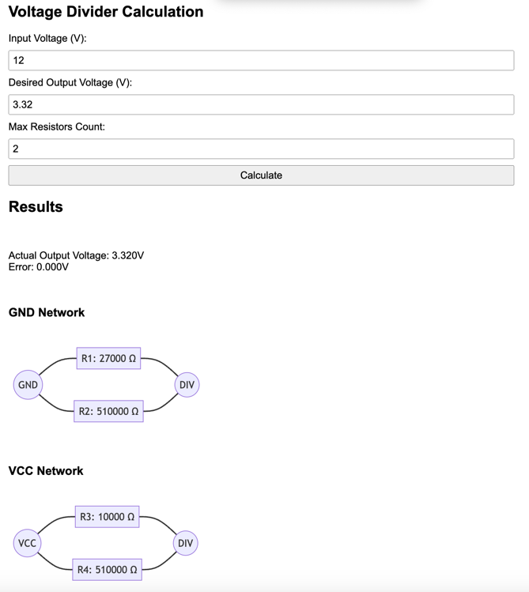

# Voltage Divider Wizard 🧙‍♂️⚡

A powerful and user-friendly online calculator for designing voltage divider circuits.

**[Try Voltage Divider Wizard Now!](https://yakud.github.io/voltage-divider-wizard/)**



## Features

- 🧮 Calculate optimal resistor combinations for voltage dividers
- 📊 Visual representation of the circuit using Mermaid diagrams
- 🛠 Customizable list of available resistors
- 💾 Automatic saving of inputs and resistor list in local storage

## How to Use

1. Visit the [Voltage Divider Wizard](https://yakud.github.io/voltage-divider-wizard/)
2. Enter your desired input voltage and output voltage
3. Specify the maximum number of resistors to use in the circuit
4. Click "Calculate" to see the optimal resistor combination
5. View the results, including the actual output voltage and circuit diagram

You can also customize the list of available resistors:
- Add new resistors using the form at the bottom of the page
- Remove existing resistors by clicking the "Remove" button next to each resistor

Your inputs and customized resistor list will be automatically saved for your next visit.

## Local Development

To run the Voltage Divider Wizard locally:

1. Clone the repository:
   ```
   git clone https://github.com/yakud/voltage-divider-wizard.git
   ```
2. Navigate to the project directory:
   ```
   cd voltage-divider-wizard
   ```
3. Install dependencies:
   ```
   npm install
   ```
4. Start the development server:
   ```
   npm run dev
   ```
5. Open your browser and visit `http://localhost:8080`

## Contributing

Contributions are welcome! If you have any ideas for improvements or bug fixes, please:

1. Fork the repository
2. Create a new branch for your feature
3. Commit your changes
4. Push to your branch
5. Create a new Pull Request

## License

This project is licensed under the MIT License - see the [LICENSE](LICENSE) file for details.

## Acknowledgments

- [Mermaid](https://mermaid-js.github.io/mermaid/#/) for circuit diagram generation
- [Marked](https://marked.js.org/) for Markdown parsing

---

Created with ❤️ by [Yakud](https://github.com/yakud)